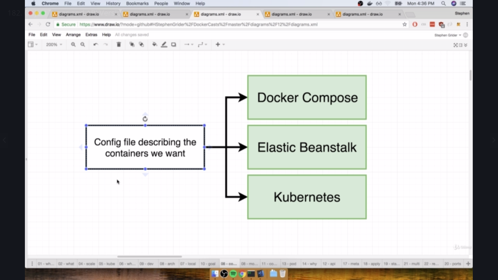

As per the `Shot13` if we want to basically put the pod then the pod would definitely be having all the tightly coupled containers in it.

* All these tightly coupled containers would interact with each other .
 
* The Smallest container that we can run on the Kubernetes is on the Pod itself.

* But to use the pod we should have the tight coupling being enabled. 


### Basically Two Object Types exist.
* Services: 
  - This is basically used for the setting up the networking.
* Pods:
  - This is basically used for setting up the tight coupling among the various containers in the cluster.

Under Services(That are basically used for the sake of the networking)
  We have subtypes for Service Object As per the `Shot14` i conclude that the subtypes can be many in number like:
  - ClusterIP
  - NodePort(Exposes a containr to the outside world(only good for dev purposes!!!))
  - LoadBalancer
  - Ingress

In the client-pod.yaml we have
```
  apiVersion: v1
  kind: service
  metadata:
  name: client-node-port
  spec:
    type: NodePort
    ports:
      - ports: 3050
        targetPort: 3000
        nodePort: 31515
    selector:
        component: web
```
As indicated in the Above file the Object kind is of Service which is used for the sake of the networking and the type is nodePort for the sake of the exposing of the contianers to the outer world ONly in development. under the spec .

------------------------------------------------------------------------------------------

Now if you take a look of the client-node-port.yaml and client-pod.yaml 

client-pod.yaml
```
apiVersion: v1
kind: Pod
metadata:
  name: client-pod
  labels:
    component: web
spec:
  containers: 
    - name: client
      image: stephengrider/multi-client
      ports:
        containerPort: 3000
```

client-node-port.yaml
apiVersion: v1
kind: service
metadata:
  name: client-node-port
spec:
  type: NodePort
  ports:
    - ports: 3050
      targetPort: 3000
      nodePort: 31515
  selector:
    component: web
```


The client-node-port.yamldirects the output to that particular pod by using the using the selector component property in the client-node-port.yaml and the client-pod.yal metadata being the same and this is being done as per the files that are being shown above

Here component: web is common in two of the files .

```
 component: web
```


the ports as we need from the node-port.yml having the nodePort(that gets being exposed to the outer world). 
  and the targetPort says the container port exposing number and that is 3000 .

and now if you can see that the node-port 

------------------------------------------------------------------------------------------

# Now let us feed a config file to the kubectl and this can be done by using


What are the imperative and Declarative Deployments in the Kubernetes.

Imperative Deployments are the ones that make the kubernetes controlling to be given to the manual controlling

Declarative Deployments:
  - Most of the Deployments are declarative and they are trying to get deployed by using the yaml scripts and the complete control being given to the kubernetes on production .



----------------------------------------------------------------------------------------------------